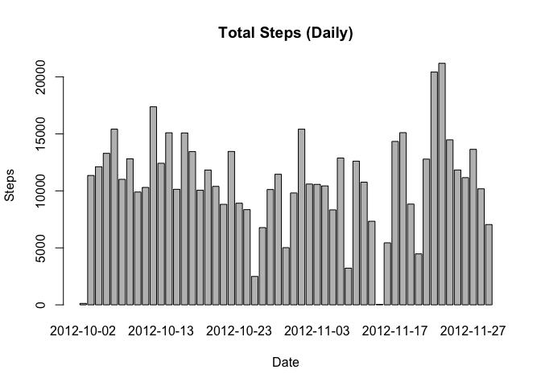
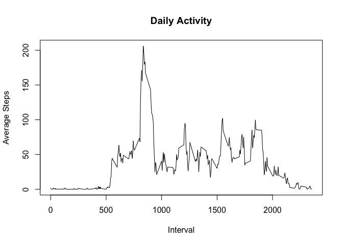
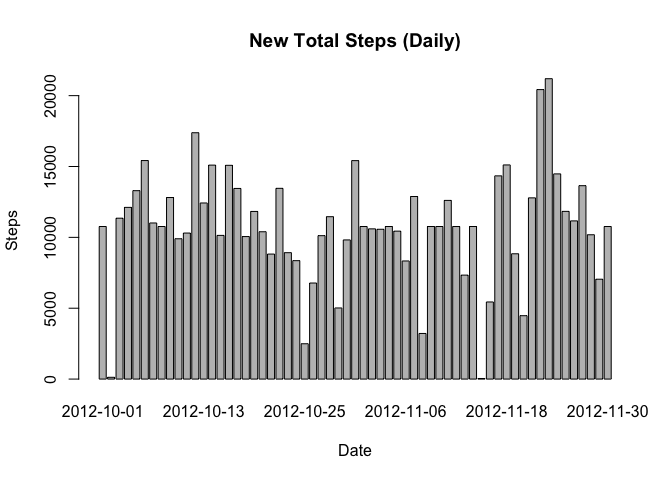
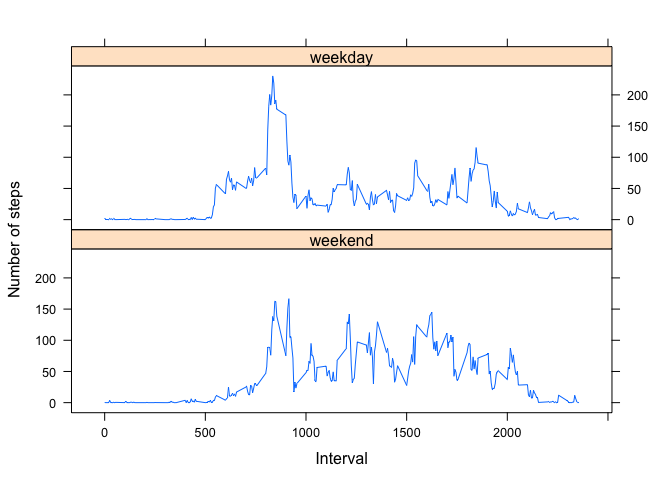

Reproducible Research: Assignment 1
===================================

1) Loading and preprocessing the data
-------------------------------------

    activity<-read.csv("~/Desktop/Data_Science/Coursera_DS/activity.csv")

2) What is mean total number of steps taken per day?
----------------------------------------------------

    steps<-aggregate(activity[,1],by=list(activity[,2]),FUN=sum)
    # ignoring NA values
    final.steps<-steps[complete.cases(steps),]
    # histogram
    barplot(final.steps$x, 
            names.arg = final.steps$Group.1, 
            main = "Total Steps (Daily)",
            xlab = "Date", 
            ylab = "Steps")

    # report mean and median
    summary(final.steps$x)

    ##    Min. 1st Qu.  Median    Mean 3rd Qu.    Max. 
    ##      41    8841   10765   10766   13294   21194

3) What is the average daily activity pattern?
----------------------------------------------

    interval<-aggregate(steps ~ interval, activity, mean)

    #plotting
    plot(interval, 
         type='l', 
         main="Daily Activity", 
         xlab="Interval", 
         ylab="Average Steps")

    #calculating max interval for max Steps
    max.steps <- which.max(interval$steps)
    interval$interval[max.steps]

    ## [1] 835

4) Imputing missing values
--------------------------

    #NA count
    sum(is.na(activity$steps))

    ## [1] 2304

To fill in the missing values, we will be using the mean per given
interval. The new dataset is called 'new.activity'.

    require(plyr)

    ## Loading required package: plyr

    require(Hmisc)

    ## Loading required package: Hmisc

    ## Loading required package: lattice

    ## Loading required package: survival

    ## Loading required package: Formula

    ## Loading required package: ggplot2

    ## 
    ## Attaching package: 'Hmisc'

    ## The following objects are masked from 'package:plyr':
    ## 
    ##     is.discrete, summarize

    ## The following objects are masked from 'package:base':
    ## 
    ##     format.pval, units

    new.activity <- ddply(activity, ~ interval, transform, steps = impute(steps,mean))

    #reordering rows in descending order, because ddply() sorts them by interval
    new.activity<-new.activity[row.names(new.activity),]

    #plotting
    new.steps <- aggregate(steps ~ date, new.activity, sum)
    barplot(new.steps$steps, names.arg = new.steps$date, main = "New Total Steps (Daily)",xlab = "Date", ylab = "Steps")

    #reporting
    mean(new.steps$steps)

    ## [1] 10766.19

    median(new.steps$steps)

    ## [1] 10766.19

The methodology used to fill in the missing values does not impact the
results.

5) Are there differences in activity patterns between weekdays and weekends?
----------------------------------------------------------------------------

    #creating new factor weekdays / weekend.
    new.activity$date <- as.Date(new.activity$date)
    new.activity$date <- factor((weekdays(new.activity$date) %in% 
            c('Monday', 'Tuesday', 'Wednesday', 'Thursday', 'Friday')), 
            levels=c(FALSE, TRUE), labels=c('weekend', 'weekday') )

    #plotting
    require(dplyr)

    ## Loading required package: dplyr

    ## 
    ## Attaching package: 'dplyr'

    ## The following objects are masked from 'package:Hmisc':
    ## 
    ##     src, summarize

    ## The following objects are masked from 'package:plyr':
    ## 
    ##     arrange, count, desc, failwith, id, mutate, rename, summarise,
    ##     summarize

    ## The following objects are masked from 'package:stats':
    ## 
    ##     filter, lag

    ## The following objects are masked from 'package:base':
    ## 
    ##     intersect, setdiff, setequal, union

    new.plot<-new.activity %>% group_by(interval,date) %>% summarise(mean = mean(steps))
    require("lattice")
    xyplot(mean ~ interval | date,data = new.plot, 
           type = "l", 
           layout = c(1,2), 
           xlab = "Interval", 
           ylab = "Number of steps", 
           main = "")

